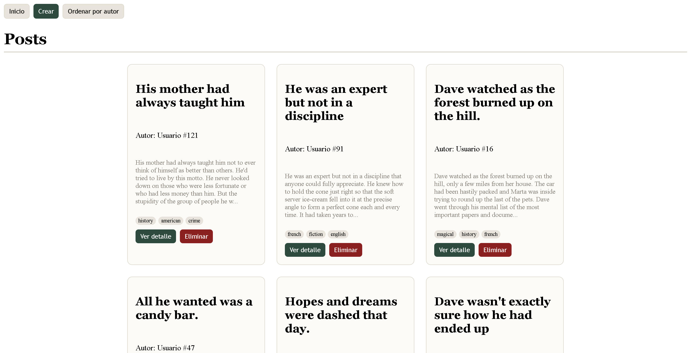

# 📌 Proyecto 1 Sistemas y tecnologías web

## 🧾 Descripción del proyecto

Esta aplicación web permite gestionar publicaciones utilizando una API externa.  
El usuario puede visualizar, crear, editar y eliminar posts, así como filtrarlos y navegar entre ellos mediante paginación.

El proyecto está desarrollado utilizando **JavaScript Vanilla**, manipulando el DOM dinámicamente y siguiendo una arquitectura modular (`api.js`, `ui.js`, `main.js`).

---

## 🌐 API utilizada

Se utilizó la API pública:

👉 https://dummyjson.com

Endpoints principales:
- `GET /posts` → obtener publicaciones
- `GET /posts/:id` → obtener detalle de una publicación
- `POST /posts/add` → crear publicación
- `PATCH /posts/:id` → editar publicación
- `DELETE /posts/:id` → eliminar publicación
- `GET /users/:id` → obtener información del autor

---

## ⚙️ Funcionalidades

- 📄 Listado de publicaciones con paginación
- 🔍 Filtros combinables:
  - búsqueda por texto
  - filtrado por autor
  - filtrado por tags (múltiples inputs)
- 👁️ Vista de detalle de cada publicación
- ➕ Creación de nuevas publicaciones
- ✏️ Edición de publicaciones existentes
- 🗑️ Eliminación con confirmación
- 🔄 Navegación entre vistas (SPA)
- ⏳ Loader y feedback visual al usuario

---



## ▶️ Instrucciones para ejecutar el proyecto

1. Clonar el repositorio:

```bash
git clone https://github.com/JAVIERCLO/proyecto1web

---

Integrantes:

Javier Chávez
Diego Sandoval

